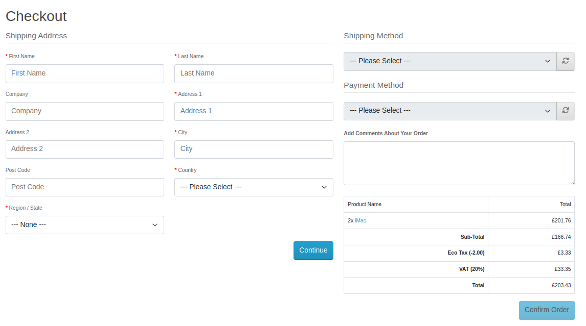
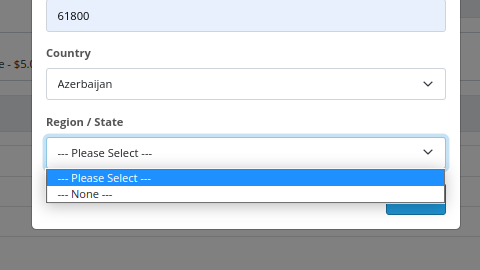

# Report for OpenCart testing

## 1 Intro
Author: Matěj Konopík, FIT BUT, April 2023, Brno

This document describes the failures found in the system during preparation of automated tests.
These failures should be resolved before the testing can be brought to full coverage of the system. Tests covering the failiures are ready, but commented out for it to run smoothly at this state. Refer to the sections 5.1 and 5.2 for details.
- Note: It is suggested to use a docker image of the system, because every run needs to create accounts for the testing procedures, and it could pollute the system with fake data. These tests are not focused on performance of the system, but solely as BDD scenarios of user manipulation.
---

## 2 Removed test
Following tests were removed from the original plan (ITS project 1):
- ```User can view his order history``` - no orders can be added to the system from user view!
- ```shop.feature``` - undergone a general rework - prepared and reworked scenarios that are actually related to shop
- ```Customer will get notified when admin changes the order status``` - doesn't regard order management
- ```Invoice and ship list``` - not sure how to check if they are generated correctly
- ```Addind a product variant```
- ```Admin can add item to order``` and ```Admin can change the shipping address of an order``` - squashed into a single scenario ```Admin can create an order```
- generally all background items were removed and the test were made procedural, so that they link together seamlessly. Remake for controlling from ```environment.py``` could be considered in the future, as it might make the code more reusable.
---

## 3 Added tests
Following tests/scenarios were added in comparison with the plan (ITS project 1):
- ```System withstands a weak try for sql injection``` - just a basic php endpoint ping with DROP TABLES comment
- ```Admin portal is not reachable without valid token``` - security check for admin access
- ```Admin can search for user by their name``` - self-explanatory
- ```Entering zero price to an item``` - check if the system does not allow for free products to be added
- ```Admin can add item to order``` and ```Admin can change the shipping address of an order``` combined into new feature ```Admin can create an order```
- *Note: Most of the scenarios were refactored for better re-usability and to fit the test case better.*
---

## 4 New tests description
- New tests are focused on the system security and user experience.
Closer notes are provided by the tests in section 5.
---

## 5 Issues to fix

### 5.1 Main known issues
- The system is missing shipping and payment method which user could use to finish the order of his items and neither can the user add them in his account information. This makes the system NOT PRODUCTION READY!
    - Depiction: 
    - *Resolution*: Add a payment gate through the OpenCart admin panel - navigate to Extensions, select desired gate and 
      integrate it. (PayPal is a valid contender, because the integration is free)
    - Please refer to Scenario  ```Customer places an order for product in their shopping card.``` at ```ITS_P2/features/shop.feature:31```
- Searching for products to be added to an order by admin is unstable. Valid item 'iMac' in the tested system is found only about a half of the time, without known cause.
    - Depiction: 
    - *Resolution* Search engine check & fix, perhaps a RE runs there which doesn't always map correctly?
    - Please refer to Scenario ```Admin can create an order``` which might be failing due to this.
- Order adding does not crosscheck the zipcode with the selected country and region. Invalid address can be entered.

### 5.2 Possible improvements & tweaks 
- The notification popups cannot be manipulated by the user. In admin pannel, it partially blocks the return button from the page ```http://mys01.fit.vutbr.cz:8084/administration/index.php?route=customer/customer|form```.
    - Depiction: 
    - *Resolution*: Direct UI reimplementation or system update to OpenCart 5.0 *(Warning - this would require reimplementation of unknown amount of tests)*.
    - Refer to ``` Admin can create new user ``` which is failing due to this
- My Account dropdown cannot bo opened by selenium and has to be accessed over class change - might not be an issue but seems weird
    - *Resolution*: UI tweaks